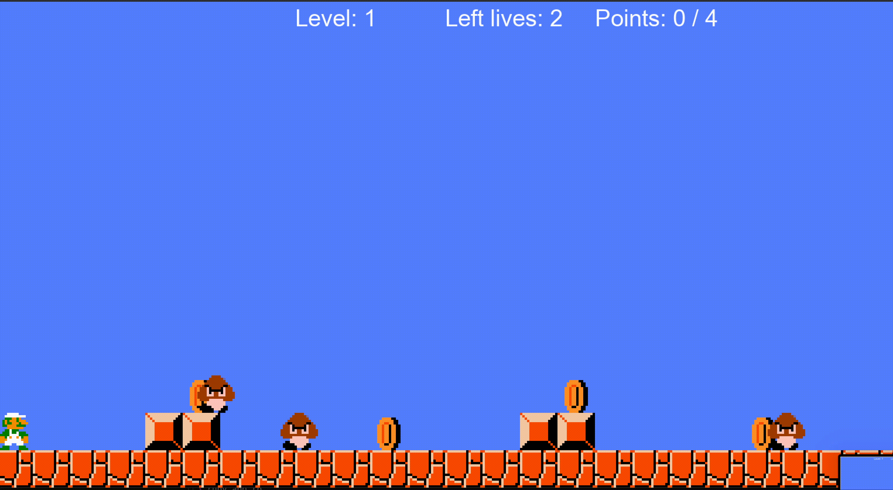

# Mario game in Ruby

Mario game written using [Ruby2d](https://www.ruby2d.com/)

Use **arrow keys** to play

To run locally run `ruby app.rb` after [configuring ruby2d](https://www.ruby2d.com/learn/get-started/)

Features:
- Collecting coins
- Die after being killed by opponents or by falling down the cliff
- Fight opponents (by jumping down)
- **Configure levels** in `levels.json` file (map, coins, monsters) 
- Have 3 lives in the whole game with the ability to restart the level (collected coins are remembered)
- Game over action

Those functionalities are presented below

**Fighting oponents and collecting all coins**:

**Three lives**

